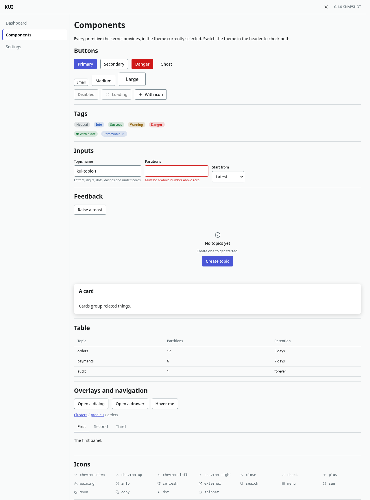
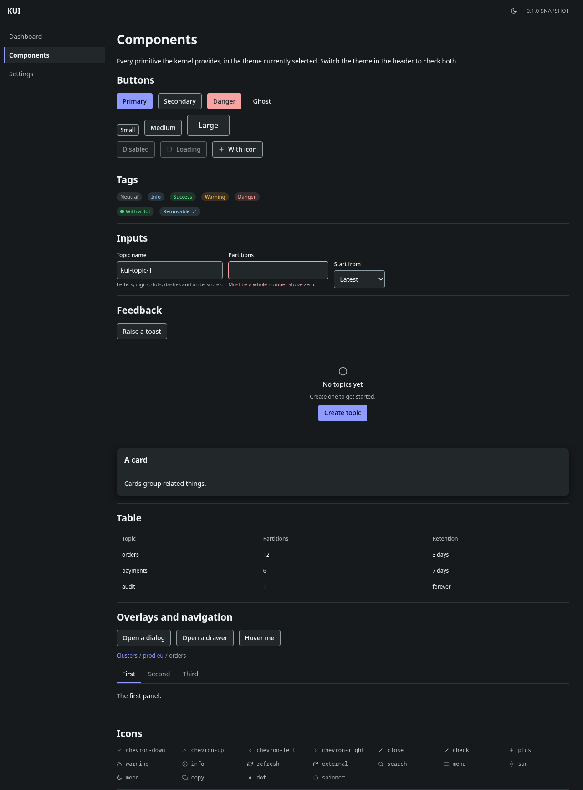

# The KUI frontend

Everything that runs in a browser. It is Scala compiled to JavaScript by
[Scala.js](https://www.scala-js.org/), with [Laminar](https://laminar.dev/) for the user interface
and plain CSS for the styling. There is no React, no TypeScript and no npm build step (ADR-011,
ADR-012, ADR-024).

If you have written a React application, the two ideas that will feel unfamiliar are worth stating
up front:

- **There is no virtual DOM and no re-render.** A Laminar component builds real DOM nodes once. What
  changes afterwards is not the tree, it is the values flowing through the bindings attached to it.
- **State is explicit and owned.** A `Var[A]` is a value that can be written; a `Signal[A]` is a
  value that changes over time and always has a current value; an `EventStream[A]` is a series of
  events with no current value. A component takes them from its caller and never creates global
  state of its own.

## Module layout

```
frontend/
  ui-kernel/            the design system and the shell's plumbing
    src/kui/ui/kernel/
      api/              ApiClient, ApiError, Bootstrap — how the browser talks to the gateway
      component/        the primitives: button, input, dialog, table, …
      css/              KernelCss — the class names, as Scala constants
      feature/          KuiFeature, FeatureRegistry, LazyFeature, FeaturePanel
      query/            QueryCache — server state, fetched once and shared
      sse/              Sse, SseParser — the two server-sent-events wrappers
      state/            the kernel-owned Vars: AuthState, NotificationBus
      theme/            Theme (light / dark / follow the system) and Tokens
    resources/css/      this module's stylesheets
    test/src/…          MUnit suites, run under jsdom
```

```
  ui-shell/             the application: router, layout, the shell's own pages
    src/kui/ui/shell/
      layout/           Layout, Header, Sidebar
      page/             HomePage, SettingsPage, GalleryPage, the error pages
      Main.scala        the one `@main` the whole frontend has
      Page.scala        ShellPage and the history.state codec
      ShellRouter.scala the single Router[Page]
    resources/css/      30-shell.css
```

Later milestones add sibling modules — `ui-clusters`, `ui-topics`, `ui-messages` — one per feature. Each is a *microfrontend*: it is compiled into
its own JavaScript module and downloaded only when the user actually needs it (ADR-012). See
[`features.md`](features.md) for how to add one.

Note that the Mill module is spelled `frontend.uiKernel` on the command line and `frontend/ui-kernel`
on disk. Mill names a module's directory after the Scala object; `build.mill` overrides that so the
directory can stay kebab-case like every other directory in the repository.

## CSS

### One file per module, concatenated in a fixed order

Each module keeps its stylesheets in `resources/css/*.css`. The Mill task `frontend.css` pastes them
all into a single `kui.css` in the order **tokens → reset → kernel → features** (ADR-024). Plain CSS
has no import graph: when two rules match the same element with equal specificity, the one written
later wins, so the concatenation order *is* the cascade and it is decided once, in
`kui.build.CssPipeline`, rather than by whatever order the filesystem returns.

```bash
./mill show frontend.css        # prints the path to the assembled kui.css
```

Note that the numeric prefixes in file names (`00-reset.css`, `10-tokens.css`) group related files
in a directory listing; they do **not** decide the cascade. A feature file called `00-anything.css`
still lands after every kernel file.

There is no preprocessor. Native CSS nesting and custom properties cover what Sass was for, and
ScalaCSS was rejected outright: its last release was in 2022 and it generates styles at run time.

### Class names live in `Css` objects, never in Scala string literals

```scala
// yes
div(cls := KernelCss.Card, …)

// no — a typo here is silent, and nothing will ever tell you
div(cls := "kui-crad", …)
```

Every module has one object of class-name constants (`KernelCss`, and one per feature). Naming is
BEM with a `kui` prefix — `kui-<block>__<element>--<modifier>` — which keeps every selector to a
single class, so specificity is uniform and the cascade stays predictable.

### Colours come from tokens, always

No component may contain a colour, a spacing value or a font size of its own. They come from the
design tokens in [`tokens.md`](tokens.md), as `var(--kui-color-…)`. That is what makes dark mode a
property of one file instead of a property of every component.

### Degraded rendering: no component may *need* its CSS

If `kui.css` fails to load — a broken deploy, a proxy that drops it — the application must still be
usable, not merely present. Concretely:

- a control's *function* comes from the HTML: a button is a `<button>`, a disabled control carries
  the `disabled` attribute, a modal carries `role="dialog"`;
- CSS supplies appearance only. Nothing may be hidden, revealed, enabled or disabled by a class
  alone.

Tabs are the usual place this rule gets broken: an implementation that renders every panel and hides
the inactive ones with `display: none` shows all of them at once when the stylesheet is missing. KUI
renders only the selected panel, so the failure mode is "unstyled but correct".

## Talking to the gateway

### How a feature makes an API call

A feature never builds an HTTP request. It asks the kernel's `ApiClient` to run an *endpoint* — a
value from a `contract` module that describes one URL, its inputs and its outputs, and that the
gateway implements from the same source. Renaming a field in the contract is therefore a compile
error in the browser and on the server at the same moment, which is the whole reason those modules
are cross-compiled.

```scala
import kui.ui.kernel.api.{ApiClient, ApiError}

// `client` is handed down from the shell. `ClusterApi.list` is an endpoint value from a
// contract module; `()` is its input.
val clusters: EventStream[Either[ApiError, List[ClusterSummary]]] =
  client.call(ClusterApi.list, ())

div(
  child <-- clusters.map {
    case Right(found)  => renderTable(found)
    case Left(failure) => renderFailure(failure)   // never a blank page
  }.toSignal(loadingPlaceholder)
)
```

Three rules follow from that, and all three are enforced by the shape of the API rather than by
review:

1. **Features never construct a backend.** There is exactly one `sttp` backend in the frontend, made
   by `ApiClient.make`, and it is the only thing configured with `credentials: "include"` — the
   option that makes the session cookie travel. A feature that made its own would be unauthenticated
   in production and would work perfectly in every test.
2. **A call never fails the stream, it emits a `Left`.** An Airstream error propagates to the
   unhandled-error handler and kills the subscription, so a page that was rendering a list stops
   rendering anything at all. Every outcome is therefore an ordinary value of type
   `Either[ApiError, O]` that a `Signal` can hold and a view can draw.
3. **Nothing retries by itself.** A silent browser retry turns a five-minute outage into a
   five-minute spinner. Retrying is an action the user takes (ADR-032's "Retry now").

A call is also *lazy* and *memoised*: building the stream sends nothing, the first subscriber sends
the request, and a second subscriber joins that request rather than issuing another.

### The headers the kernel adds, so no feature has to

| Header | On | Where it comes from |
| --- | --- | --- |
| `X-Csrf-Token` | every request that is not a `GET` | `AuthState.csrfToken`, filled by `/auth/me` (ADR-019) |
| `X-Kui-Request-Id` | every request | generated per call, for support correlation |

The CSRF header is deliberately **not** called `X-Kui-Csrf`, and the name is not written out in
either half of the codebase: both read it from `kui.contracts.HttpHeaders.Csrf`. The gateway strips
every inbound `X-Kui-*` header at the edge, because that family is how the gateway talks to itself
and no browser ever legitimately sets one (ADR-040) — so a CSRF header inside the family would be
deleted before the check that needs it ever ran. When the two halves each spelled the name out for
themselves they drifted apart, and nothing failed to compile: the browser sent a header the gateway
did not read and every mutation came back `403`. Sharing one constant is what makes that impossible.

The gateway still mints the authoritative correlation id (GW-001). `X-Kui-Request-Id` is a second
thread to pull on when a user says "it failed at about ten past three", and it is not yet built on:
treat it as a hook, not as a feature.

### The four shapes a failure takes

`ApiError` has four cases because a caller genuinely treats them differently.

| Case | What happened | What the UI does |
| --- | --- | --- |
| `Envelope(code, message, …)` | the server answered and said what was wrong (ADR-034) | render `message`; offer a retry when `retryable` |
| `Unreachable(cause)` | nothing answered — offline, DNS, gateway down | counts towards the full-screen state (UI-011) |
| `Timeout` | nothing answered in time | as above |
| `Decoding(cause)` | something answered, and it was not the contract | a bug, not an outage: never the full-screen state |

`code` is a `String` and not the `ErrorCode` enum on purpose: a browser built today has to render a
failure a gateway built tomorrow invented, rather than fail to parse it.

### Where the base URL comes from

Never from a constant. The gateway injects a `<script id="kui-bootstrap" type="application/json">`
block into `index.html` (GW-008) carrying `basePath`, `apiBase` and `buildVersion`, and
`Bootstrap.read()` reads it. An operator who mounts KUI at `https://tools.example.com/kafka/` needs
every URL to gain that prefix, and neither the build nor a constant can know it.

A missing or malformed block is not an error: it falls back to the root deployment
(`apiBase = "/api/v1"`), which is what a development build opened without a gateway needs.

### Server state: `QueryCache`

A screen is made of independent components, and several usually want the same thing — the header,
the breadcrumb and the table on a cluster page all begin by asking for the cluster. Written naively
that is three identical requests and three different answers on screen while they are in flight.

`QueryCache` is the answer: components ask it, it asks the server at most once, and everybody
watches the same value. It is what react-query does in the reference implementation.

```scala
val clusters = QueryCache.make[ClusterId, Cluster](id => client.call(ClusterApi.get, id))

// Nothing is fetched here. The request happens when this signal is subscribed to — which in
// Laminar means when the element holding it is mounted — and only if what is cached is missing
// or stale.
div(child <-- clusters.get(id).map {
  case Pending(_)                  => spinner
  case Resolved(_, Right(value), _) => renderCluster(value)
  case Resolved(_, Left(failure), _) => renderFailure(failure)
})
```

Four behaviours are worth knowing before you use it:

- **Demand-driven.** When the last subscriber goes away the entry stops being refreshed and becomes
  a candidate for eviction, so a page the user left behind does not keep talking to the server.
- **Failures are cached too**, but for five seconds instead of thirty. Not caching them at all means
  every component that wanted the data retries independently, and a struggling endpoint is hit by
  the whole page at once.
- **`invalidateWhere` is prefix invalidation.** After creating a topic on cluster A, every cached
  list belonging to cluster A is wrong and everything belonging to cluster B is still good;
  invalidating everything would be correct and would also refetch the entire application.
- **`fetchedAt(key)`** is the timestamp ADR-032 puts next to stale data that stays on screen.

### Streaming: which of the two wrappers to use

| | `Sse.eventSource` | `Sse.fetchStream` |
| --- | --- | --- |
| Underlying mechanism | the browser's `EventSource` | `fetch` plus KUI's own parser |
| Reconnects by itself | yes | no |
| Can `POST` / send headers | no | yes |
| Can be aborted | no | yes |
| Use it for | `GET` streams — the capability stream | streams with a request body, or that the user must be able to stop |

The rule of thumb: **`eventSource` unless you need a body or cancellation.** The browser's own
object handles reconnection, cookies and a backgrounded tab better than anything written by hand.
Reach for `fetchStream` when the stream cannot be a `GET` (M3's message browsing sends a filter) or
when stopping it matters — aborting propagates all the way down, cancelling the gateway's stream,
the service's fiber and its Kafka consumer (ADR-035).

Both return an `SseHandle`: the events, a `Signal[SseConnection]` for the connection indicator, and
`close()`. Three rules they share:

- a **decode failure for one event does not end the stream** — it is reported as
  `Left(SseError.Decode)` and reading continues, the same rule ADR-035 gives the server;
- **`heartbeat` is swallowed.** Its only job is to stop a proxy from reaping an idle connection, and
  forwarding it would make every caller filter it out;
- **`error` and `done` are terminal** (ADR-035). `error` carries the ordinary error envelope, so a
  failure after the headers were sent is handled by the same code as one before.

## The shell

### Structure

`ui-shell` is the Scala.js **entry point**: the one `@main` in the whole frontend (ADR-012). The
linker is run on this module, and feature microfrontends are reached from it only through
`FeatureRegistry`'s dynamic imports — which is what lets the linker put each feature in a JavaScript
module the browser downloads on demand.

The frame is a header across the top, a navigation column on the left, a content region in the
middle, and the toast host. The header and the sidebar are built once; only the content changes.
Handing `Layout` a `Signal[HtmlElement]` rather than an element is what makes that true, and it is
what keeps focus, scroll position and open menus in the frame alive across a navigation.

The first focusable element in the document is a "skip to content" link. It is visually hidden until
focused, so it costs sighted users nothing; without it a keyboard user tabs through every navigation
entry before reaching the page, on every page, every time. It must stay first.

### The route-before-import rule

This is the one thing about the shell that is easy to get wrong and expensive to discover.

A deep link — a bookmarked or pasted URL landing directly on a feature page — must resolve on the
**first** load, before that feature's JavaScript module has been downloaded. If the router only
learned about a URL once its feature had been imported, the very first address it saw would be one
it could not match, and the user would get a 404 for a page that exists.

So each feature contributes **two** things, and they travel separately (ADR-012 amendment 2):

| | what it is | when it is loaded |
| --- | --- | --- |
| `List[Route[? <: Page, ?]]` | data — path shapes | eagerly, with the shell |
| the render functions | code | on the first navigation, through `js.dynamicImport` |

Route patterns cost a few bytes in `main.js` and pull nothing else in. `checkBundleShape`
(BUILD-006) fails the build if a real class reference leaks across that line.

Feature routes are appended **after** the shell's own, so a feature cannot accidentally shadow
`/ui/settings` by declaring a pattern that also matches it.

### Every route ends with `endOfSegments`

Without it a pattern matches a *prefix*: `/settings` would also claim `/settings/anything`, and the
404 for a mistyped sub-path would never appear. ADR-011 also asks for the explicit form as forward
compatibility with Waypoint 10, where it becomes the only form.

### Page elements are built once, not once per navigation

`SplitRender.collectStatic` takes its view **by name** and re-evaluates it every time the page signal
emits that page — including when it re-emits the page already on screen. The shell wraps each in a
`lazy val`, which turns that into "built on first visit, reused afterwards". Getting this wrong does
not look like a bug: the page simply loses its scroll position and any open menu on every update.

### When something throws

There is no error boundary and none is needed, because there is no render pass to fail. What there
is instead are two escape routes, and each has its own answer:

- an exception inside an Airstream callback goes to a global handler, whose default rethrows into an
  empty stack where nobody sees it. `ErrorReporting.install()` replaces it with one that raises a
  toast and writes the detail to the console;
- an exception while *building* a page's element happens before anything is mounted, leaving the
  content area blank with the shell still around it. `ErrorReporting.renderSafely` wraps every page's
  construction so that a page which throws shows a panel saying so.

### Which error surface to use

KUI has three, and picking the wrong one is the most likely future mistake here — so the rule is
written down rather than left to judgement.

| surface | when | who owns it |
| --- | --- | --- |
| **404 / 403 page** | the *address* is wrong, or the user may not see this *page* | the shell (`NotFoundPage`, `ForbiddenPage`) |
| **feature fallback panel** | one feature's service is unavailable | the feature, through `KuiFeature.unavailableView` |
| **full-screen "cannot reach gateway"** | the *shell's own* calls cannot reach the gateway | the shell (`GatewayUnreachable`) |

The distinction that matters is the third row. The full-screen state takes the entire application
away from the user. That is right when the gateway is genuinely not there — nothing works, and
pretending otherwise wastes their time — and it is a catastrophe when it is triggered by one
feature's endpoint being down, because everything else still worked and they have just been thrown
out of it. So every call declares its scope, and only `CallScope.Shell` can lead to the full-screen
state:

```scala
ShellHealth.report(CallScope.Shell, outcome)     // /auth/me, /info, the capability endpoints
ShellHealth.report(CallScope.Feature, outcome)   // everything a feature asks for
```

Three further rules follow from what "unreachable" actually means:

- **three consecutive failures, not one.** A laptop's wifi hiccups several times a day, and a
  full-screen takeover per hiccup is worse than the hiccup. Any success resets the count.
- **a `403` or a `404` is not unreachable.** The gateway answered, and answering is the opposite of
  being unreachable; escalating one would hide a permission problem behind a network one. Only
  `ApiError.Unreachable` and `ApiError.Timeout` count — `ApiError.isTransport` is that test.
- **a success from a *feature* still counts as contact.** If a feature's request came back, the
  gateway is reachable whatever the shell's last attempt did, and leaving the full-screen state on
  top of a demonstrably working application would be absurd.

The full-screen state retries by itself on a 2 s, 4 s, 8 s, 16 s, 30 s ladder, shows the countdown,
offers a manual "Try again" that attempts at once and restarts the ladder, and says when contact was
last made. It disappears on the first success with no reload — nothing is rebuilt, so whatever state
the application held is still there. And it renders with no API data at all, which it has to: by
definition nothing answered.

### The component gallery

`/ui/gallery` shows every kernel primitive, every tone and every size on one page, in whichever theme
is switched on. It is a development page, not a product feature: its job is to make a change to a
primitive reviewable, so that a change to the button's padding is seen next to the tag and the toast
it has to line up with. Screenshots of both themes are in
[`screenshots/`](screenshots/) and are regenerated when a primitive changes.





## Building a screen: where "how it looks" and "what it does" come from

Two different documents govern a screen, and mixing them up is the most common mistake. Read this
before you build one.

**How it should look** — layout, spacing, typography, colour, and interaction affordances (what a
button looks like, where it sits, what hover/focus/disabled/busy look like) — comes from the Claude
Design project *Kafka UI v2*, current main artboard `Kafka UI v2.dc.html`. That design is revised
over time and re-imported at the start of every milestone's grooming; whatever the import produced
lands under `research/design/`, and the revision it came from is recorded in
`research/design/REFERENCE.md`. No HTML, CSS or JavaScript from the design is ever copied into this
repository — it is reimplemented in Laminar with KUI's own CSS and the kernel's tokens (ADR-024).

**What it should do** — what the screen is for, which data it shows, where that data comes from,
what each action performs, what a form validates, and what happens when a call fails, is forbidden,
is slow, or returns nothing — comes from the researched behaviour of the two reference products,
Kafbat Kafka UI and Provectus Kafka UI, written down in `research/` (start with
`research/kafbat/ui-analysis.md`), plus `docs/FEATURE_MATRIX.md` for which behaviours KUI has
committed to.

A worked example. You are building the topic list.

- From the design you take: that it is a full-width table, the column widths and alignment, the
  type scale of the header row, the pill used for the "internal topic" marker, the placement and
  shape of the search box, and what a row looks like while it is loading.
- From the research you take: that the list is paged and searchable server-side, which columns
  exist at all (partitions, replication factor, size, message count), that "internal" means the
  topic name starts with an underscore, what the delete action asks for before it fires, and what
  the screen shows when the cluster is unreachable rather than merely empty.
- If the artboard shows a column the research never mentions and no feature-matrix row covers, you
  do **not** invent its meaning. Either a matrix row is proposed, researched and accepted first, and
  the column is built by whatever task then owns it — or the column is not built. See case 1 below.

**When they disagree, the research wins.** If the design implies a behaviour that contradicts the
researched behaviour — an action that would delete without confirming, a screen that would show data
KUI does not fetch — implement the researched behaviour and *record the difference* in
`research/design/gaps.md` and in the task file: which artboard implied what, what was done instead,
and why. Do not resolve it silently; the next person will otherwise re-open the same argument with no
record that it was already settled.

Note which file: `research/design/REFERENCE.md` is a faithful reading of *what the design is* —
identity, revision, values under the design's own names — and nothing about a disagreement belongs in
it. `research/design/gaps.md` is the register of disagreements.

One rule sits above both: **a colour pair from the design that fails WCAG AA contrast is adjusted,
not adopted**, and the adjustment is written down. Accessibility outranks fidelity to a mockup. See
PLAN §21 "Visual design reference" for the same rules in their canonical form.

### Three cases, worked through

The rule above is easy to agree with and hard to apply, because the interesting cases are the ones
where the design is *not* simply wrong. Here are the three that come up, with the answer written out
so nobody has to re-derive it. Note that the first two end in "do not build it" and the third ends
in "build it anyway, altered" — that asymmetry is the whole point, and it is not arbitrary.

**1. The design shows a topic list with a column the reference products do not have.**

The column is not built.

Which columns a table has is *what the screen shows*, not *how it looks*, so it is outside the
design's authority however finished the artboard looks. Nobody knows what the column means: an
artboard can show a header and a plausible-looking number without anything in the product being able
to produce that number, and the sample data in an artboard is invented (`research/design/REFERENCE.md`
says so explicitly). Implementing it means inventing a definition, a data source and a failure mode,
and the next person will read all three as specified behaviour.

So: take the design's *treatment* of the table — its widths, alignment, header type scale, row
density — and render only the columns the research and `docs/FEATURE_MATRIX.md` establish. Record the
extra column in `research/design/gaps.md` as a bucket C item (UI-013 step 5). If it looks like a
feature KUI should have, a feature-matrix row is **proposed** there; it is not added, because matrix
rows come from research and product scope. Once such a row exists and is researched, the column gets
built by the task that owns that row — not by the styling pass.

**2. The design shows a button in a place where the researched behaviour has no such action.**

The button is not built, and this is a stronger "no" than case 1.

Same reason — an action is behaviour — but with more at stake: a column that shows the wrong thing
is a display bug, whereas a button that does the wrong thing changes a cluster. There is no safe
placeholder. A button wired to nothing is worse than an absent button, because a disabled or inert
control tells an operator the capability exists and is merely unavailable to them right now, which is
the vocabulary ADR-032 reserves for capability and permission states that are actually true.

Two follow-on points that catch people out:

- **Take the layout without the action.** If the design's toolbar is balanced around three buttons and
  research supports two, lay the toolbar out for two. Do not reserve the third slot, and do not
  invent a handler to fill it. (`__cluster-slot` in the shell header is not a counter-example: that
  space is reserved for a *specified* M1 feature, and the reservation is documented.)
- **A button that KUI already has, drawn differently, is not this case at all.** That is styling, and
  the design wins outright.

Record it in `research/design/gaps.md` the same way, with the researched position written beside the
design's so the disagreement stays visible.

**3. The design's palette fails contrast in dark mode.**

The palette is adopted and *adjusted*. It is never rejected, and the test is never relaxed.

This one sits inside the design's own authority — colour is exactly what the design decides — so
"research wins" does not apply and there is nothing to send back. What applies instead is the
accessibility rule, which is a decision already taken (PLAN §21, UI-013 step 4): the failing value is
moved along its own hue, by the smallest amount that clears the threshold, until `ContrastSuite`
passes in **both** themes.

The three things that are never the fix:

- lowering a minimum in the pair table in [`tokens.md`](tokens.md), or deleting a row from it —
  `ContrastSuite` reads that table, so either one disables the check rather than satisfying it;
- shipping the design value in light and a different one in dark *without recording it*;
- fixing only the explicit `[data-theme="dark"]` block. The dark palette is declared twice (see
  [`style-surface.md`](style-surface.md) §2.1) and a test asserts the two copies are identical.

The adjusted value keeps a `/* kui */` provenance marker, and the **original design value is recorded
beside the shipped one** in `tokens.md`. That record is load-bearing: without it the next importer
sees the stylesheet disagreeing with the design, reads it as a transcription error, and quietly
reverts the accessibility fix.

Note the limit of the check while you are here: `ContrastSuite` verifies documented *token pairs*
only. A dark palette can pass all thirty checks and still be unreadable where a colour is composed at
run time — a `color-mix()` hover shade, a backdrop, a disabled control's opacity. Those are checked
by eye against `/ui/gallery` in both themes ([`style-surface.md`](style-surface.md) §5.4).

## What the user sees for a feature: the derivation table

Every dimmed sidebar entry and every fallback panel in KUI comes from one pure function,
`FeatureState.derive`. It takes what the gateway says about a service's capability and what RBAC
says about the user, and returns one of five states. `FeatureStateSuite` is this table, row for row;
the table is reproduced here for readers who will not open the suite.

| capability from the gateway | permitted | `FeatureState` | on screen |
| --- | --- | --- | --- |
| *nothing reported yet* | true | `Degraded(Starting)` | normal entry, amber dot |
| `Available` | true | `Ready` | normal entry |
| `Degraded(reason)` | true | `Degraded(reason)` | amber dot, page usable, inline banner |
| `Unavailable(reason, message, since)` | true | `Unavailable(…)` | dimmed, **still clickable** → fallback panel |
| `NotConfigured` | true | `NotConfigured` | hidden |
| *anything* | **false** | `Forbidden` | disabled with a tooltip, or hidden |

Three rows are easy to get wrong, so their reasons are written down:

- **`Forbidden` outranks every health state** (ADR-032 amendment 1). A user who may not see the
  schema registry must not be able to learn from the sidebar whether it is up, how long it has been
  down, or what its upstream error message said. Deriving from two independent inputs means both can
  apply at once, and this is which one wins.
- **A capability nobody has reported yet is `Degraded(Starting)`, never `Unavailable`** (amendment
  2). Between the gateway starting and its first readiness poll it has no information; reporting
  `Unavailable` would be a claim it cannot support, and every operator who restarted the gateway
  would watch the whole sidebar go red for one polling interval — which teaches people to ignore the
  colour that matters.
- **`Unavailable` stays clickable.** The page it leads to is the feature's own fallback panel, which
  is the only place the reason, the `since` and a working retry exist. A disabled link has nowhere to
  put any of that, which is why ADR-032 amended the original plan.

`NotConfigured` is not a failure. A cluster with no schema registry attached does not have a *broken*
schema registry, and rendering it as one sends an operator hunting for an outage that does not exist.

### The rendering rules, and where each one lives

The table above says what a state *is*; this one says what is drawn, and names the file that draws
it, so a wrong pixel can be traced to a line without a search.

| `FeatureState` | sidebar entry | route renders | drawn by |
| --- | --- | --- | --- |
| `Ready` | normal | the feature's page | `Sidebar`, `FeatureGate` |
| `Degraded(reason)` | normal, amber dot, tooltip carrying the reason | the feature's page, with the banner | `Sidebar`, `CapabilityBanner` |
| `Unavailable(…)` | dimmed, **still a link** | `FeatureFallbackPanel` | `Sidebar`, `FeatureGate` |
| `Forbidden` | shown, `aria-disabled`, no `href`, permission tooltip | a short notice, no retry | `Sidebar`, `FeatureGate` |
| `NotConfigured` | hidden | a short notice | `Navigation`, `FeatureGate` |

Two rules about *loading* ride along with this table, and both are ADR-012's:

- The feature's module is downloaded only in the `Ready` and `Degraded` rows. Clicking a dimmed
  entry renders the fallback without fetching a byte, which is asserted by `FeatureGateSuite`.
- There is never a blank frame. While the import is in flight the content area shows a spinner that
  **names the feature**, because a bare spinner leaves a user on a slow connection unable to tell
  whether the thing they clicked is the thing that is loading.

`kui.ui.hideForbidden` turns the `Forbidden` row into a hidden entry, for deployments that consider
the existence of a feature sensitive. It is off by default: most organisations find a
visible-but-disabled entry more helpful than a menu that changes shape per user.

### What each reason code says out loud

One sentence per `ReasonCode`, written for an operator deciding what to do next rather than for a
developer reading a log — which is why none of them names an HTTP status. They live in
`kui.ui.shell.Messages` (ADR-024: strings centralised per module, no i18n runtime), and the shell
prefers the gateway's own `message` when it sent one, because that is the more specific of the two
and it mentions the actual upstream.

| `ReasonCode` | what the user reads |
| --- | --- |
| `UpstreamUnavailable` | The service is not responding. |
| `UpstreamTimeout` | The service is taking too long to answer. |
| `CircuitOpen` | KUI has stopped calling this service for a moment after repeated failures, and will try again by itself. |
| `UpstreamAuth` | The service refused KUI's credentials. |
| `NotConfigured` | This is not configured in this deployment. |
| `Forbidden` | You do not have permission to use this. |
| `Starting` | KUI has not checked this service yet. |
| `Unknown` | Something is wrong with this service, and KUI cannot say what. |

### When the capability stream drops

The picture goes **stale**, and nothing more. Every feature keeps its last known state, a banner at
the top of the content says the connection was lost, and the store falls back to polling the
snapshot every thirty seconds. Marking every feature unavailable because one connection failed would
take a working product off the air on no evidence at all. The complementary rule is enforced
upstream: an unknown state is `Degraded(Starting)`, never `Ready`, so nothing is ever silently
claimed to be working.

`Reconnecting` deliberately raises no banner. A stream between attempts is ordinary — a proxy
recycling a connection, a laptop's wifi blinking — and a banner that flickers every few minutes is
one people learn to ignore.

### Where the wire meets the kernel

`FeatureState` is also the one place the capability DTOs are named. `KuiFeature.unavailableView` takes
the kernel's own `UnavailableReason(code, message, since)` and never the wire type, so a new field on
the DTO changes nothing below this line. The translation is
`FeatureState.unavailableReason`, and it belongs here rather than in `kui.ui.kernel.feature`
deliberately: the kernel's primitives are the bottom of the frontend, and the bottom must not depend
on the shape of one service's response.

## The development loop

There is no bundler, no dev server and no proxy. The gateway serves the browser code and the API
from one origin, so the two cannot be out of step and there is no second process to keep running
(ADR-012 amendment 1).

```
./mill devStart                            # the whole product, in the background, on :8080
./mill -w frontend.uiShell.fastLinkJS      # re-links on every save
```

Edit a file, save it, refresh the browser. That is the entire loop. A re-link takes a few seconds;
nothing restarts, and nothing is copied.

### Why nothing is copied

`StaticRoutes` serves `/ui/…` from the classpath under `/web`. `./mill devStart` puts two extra
directories at the front of that classpath, each one containing a symbolic link named `web`:

```
out/dev-assets/js/web   ->  out/frontend/uiShell/fastLinkJS.dest   (main.js and every split chunk)
out/dev-assets/css/web  ->  out/frontend/css.dest                  (kui.css)
```

A classloader takes the first entry that has the file, so `/web/main.js` resolves through the first
link, `/web/kui.css` through the second, and `/web/index.html` — which is in neither — falls through
to the gateway's own resources. The linker rewrites the files behind the first link in place, so the
next request already sees them.

### Scala.js has no hot module replacement

A refresh is the loop, and that is not a temporary state of affairs: Scala.js compiles to a module
graph the browser loads at startup, and there is no mechanism for swapping a class out of a running
program. Anything that depends on in-page state — a form half filled in, a stream part way through —
starts again on refresh. Structure a page so that is cheap rather than trying to avoid it.

### Foreground or background

`./mill dev` runs the same server in the foreground, with the log on screen and Ctrl-C to stop. It
is the right thing for a first run and the wrong thing for editing, because Mill serialises its
invocations on the output directory: while `./mill dev` holds the terminal, `./mill
frontend.uiShell.fastLinkJS` waits for it instead of linking. `devStart` detaches, which releases
that lock. Its log is in `out/dev.log`; `./mill devStop` ends it.

## Tests

Frontend suites are MUnit, run under jsdom (a `document` implemented in JavaScript) rather than a
real browser. jsdom is fast and good enough for structure, attributes and events; it is not a
browser, and it approximates layout, so nothing here may assert geometry.

```bash
export PATH="$HOME/.nvm/versions/node/<version>/bin:$PATH"
npm install --no-save jsdom          # once per checkout, into the repository root
./mill frontend.uiKernel.test
```

See [`../development/toolchain.md`](../development/toolchain.md) for why jsdom has to live in a
`node_modules` at the repository root.

Run Scala.js test tasks on their own rather than folding them into `./mill __.test`: a Scala.js test
module and a JVM test module in one Mill invocation currently fail together (blocker B-003).

## Further reading

- [`tokens.md`](tokens.md) — the design tokens, the theme model and the contrast rules.
- [`style-surface.md`](style-surface.md) — the full inventory of what a restyle touches: every token
  and value, every stylesheet and the cascade order, every hard-coded visual literal, and the line
  between what a design import may replace and what it may not.
- [`components.md`](components.md) — the primitive catalogue, with each component's API and its
  accessibility contract.
- [`features.md`](features.md) — how to add a microfrontend.
